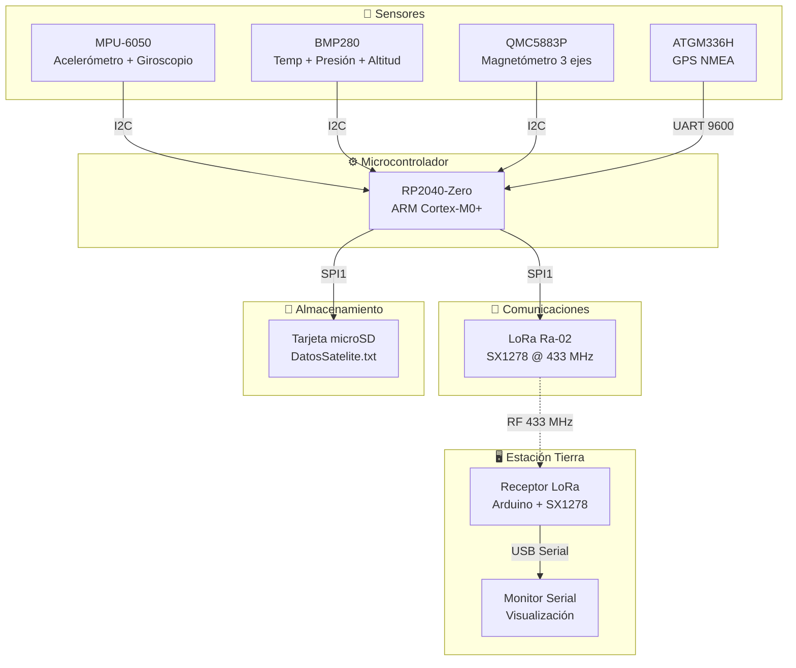
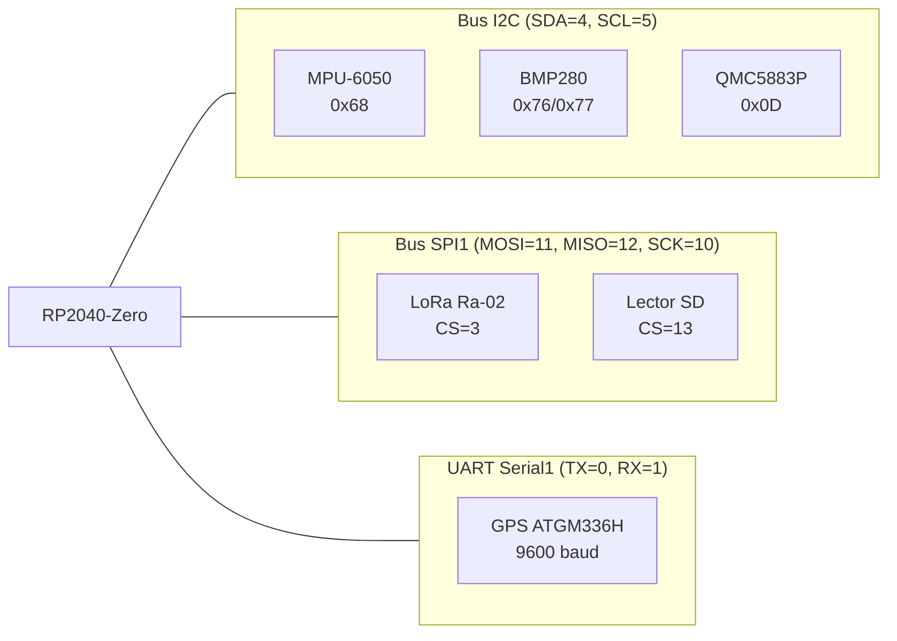
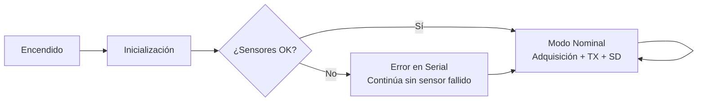

<div align="center">

# 🛰️ Nanonauta

**Firmware de vuelo para picosatélite educativo tipo CanSat**

-blue)


---

*Picosatélite que recolecta datos ambientales y de orientación durante el vuelo, los transmite en tiempo real vía LoRa y los respalda en tarjeta microSD.*

</div>

---

## 📋 Resumen Ejecutivo

**Nanonauta** es un picosatélite (CanSat). Su misión consiste en adquirir telemetría multiparamétrica — aceleración, rotación, temperatura, presión atmosférica, altitud barométrica, campo magnético y posición GPS — durante un vuelo suborbital. Los datos se transmiten en tiempo real a una estación terrestre mediante enlace LoRa a 433 MHz, y simultáneamente se almacenan en una tarjeta microSD como respaldo ante pérdida de comunicación.

El sistema opera con un ciclo de adquisición de ~1 segundo, utiliza formato CSV para máxima interoperabilidad, y emplea mecanismos de validación (CRC, SyncWord) para garantizar la integridad de los datos recibidos en tierra.

---

## 🎯 Descripción General

| Aspecto | Detalle |
|---------|---------|
| **Tipo de misión** | Recolección de datos ambientales y de actitud en vuelo |
| **Plataforma** | Waveshare RP2040-Zero (ARM Cortex-M0+ dual-core) |
| **Comunicación** | LoRa SX1278 @ 433 MHz |
| **Sensores** | IMU 6-DOF, barómetro, magnetómetro, GPS |
| **Almacenamiento** | microSD (SPI) |
| **Cadencia de telemetría** | ~1 paquete/segundo |
| **Identificador de misión** | `SAT7X` |

---

## 🏗️ Arquitectura del Sistema



### Diagrama de buses



---

## 🔧 Hardware Utilizado

### Picosatélite

| Componente | Modelo | Interfaz | Función |
|---|---|---|---|
| Microcontrolador | Waveshare RP2040-Zero | — | Procesamiento central, coordinación de subsistemas |
| IMU | MPU-6050 | I2C (0x68) | Acelerómetro ±2g, giroscopio ±250°/s, temperatura |
| Barómetro | BMP280 | I2C | Temperatura, presión atmosférica, altitud barométrica |
| Magnetómetro | QMC5883P | I2C | Campo magnético 3 ejes (rango ±8 Gauss) |
| GPS | ATGM336H | UART 9600 | Posición geográfica (lat, lng, altitud, satélites) |
| Transceptor radio | LoRa Ra-02 (SX1278) | SPI1 | Transmisión de telemetría @ 433 MHz |
| Almacenamiento | Lector microSD | SPI1 | Registro local de datos como respaldo |
| Batería | LiPo 3.7V 800mAh | — | Alimentación principal |
| Regulador | XL6009 Step-Up | — | Conversión 3.7V → 5V |

### Estación de tierra

| Componente | Modelo | Interfaz | Función |
|---|---|---|---|
| Microcontrolador | Arduino (compatible) | — | Recepción y decodificación de paquetes |
| Receptor radio | LoRa SX1278 | SPI | Recepción @ 433 MHz |

---

## 📌 Mapa de Pines (RP2040-Zero)

| Pin GPIO | Función | Periférico |
|---|---|---|
| 0 | TX (Serial1) | GPS ATGM336H |
| 1 | RX (Serial1) | GPS ATGM336H |
| 2 | LORA_RST | Reset por software del SX1278 |
| 3 | LORA_NSS (CS) | Chip Select del módulo LoRa |
| 4 | SDA (I2C) | MPU-6050, BMP280, QMC5883P |
| 5 | SCL (I2C) | MPU-6050, BMP280, QMC5883P |
| 6 | LORA_DIO0 | Interrupción TX/RX completado |
| 10 | SCK (SPI1) | LoRa + SD (compartido) |
| 11 | MOSI (SPI1) | LoRa + SD (compartido) |
| 12 | MISO (SPI1) | LoRa + SD (compartido) |
| 13 | CS_PIN (SD) | Chip Select del lector microSD |

> **Nota:** El bus SPI1 es compartido entre LoRa y SD. La multiplexación se realiza mediante las señales CS (Chip Select): solo un dispositivo activo a la vez.

---

## 📂 Estructura del Código

```
Nanonauta/
├── picosatelite/
│   └── CodigoCompleto_Satelite/
│       └── CodigoCompleto_Satelite.ino   ← Firmware de vuelo
├── estacion_tierra/
│   └── Receptor/
│       └── Receptor.ino                  ← Firmware del receptor
├── docs/
│   ├── esquematico.pdf                   ← Esquemático del circuito
│   └── Pinout-RP2040-ZERO.jpg           ← Referencia de pines
├── README.md
└── LICENSE
```

---

## ⚙️ Estructura del Firmware (Satélite)

### `setup()`

Inicialización completa del sistema al encendido:

```cpp
void setup() {
  // 1. Inicializar comunicación serial de debug (9600 baud)
  // 2. Configurar Serial1 para GPS (RX=1, TX=0, 9600 baud)
  // 3. Configurar I2C (SDA=4, SCL=5)
  // 4. Despertar MPU-6050 (registro 0x6B = 0x00)
  // 5. Activar bypass I2C en MPU (permite acceso directo a sensores externos)
  // 6. Inicializar BMP280
  // 7. Inicializar QMC5883P (modo normal, rango 8G)
  // 8. Configurar pines SPI1 (MISO=12, MOSI=11, SCK=10)
  // 9. Configurar pines CS como OUTPUT
}
```

### `loop()`

Ciclo principal de adquisición y transmisión (~1 segundo por iteración):

```cpp
void loop() {
  // 1. Leer 14 bytes del MPU-6050 (aceleración + temp + giroscopio)
  // 2. Convertir datos crudos a unidades físicas (g, °/s, °C)
  // 3. Leer BMP280 (temperatura, presión, altitud)
  // 4. Leer QMC5883P (magnetómetro XYZ)
  // 5. Inicializar LoRa en SPI1 (433 MHz, SyncWord, CRC)
  // 6. Leer datos GPS desde Serial1
  // 7. Construir y transmitir paquete CSV por LoRa
  // 8. Imprimir resumen en Serial (debug)
  // 9. Guardar datos en SD (DatosSatelite.txt)
  // 10. Esperar 1000 ms
}
```

### Funciones auxiliares

| Función | Propósito |
|---|---|
| `escribirRegistro(byte reg, byte val)` | Escribe un valor en un registro I2C del MPU-6050 |
| `leerRegistros(byte reg, byte* datos, byte n)` | Lee `n` bytes consecutivos desde un registro del MPU-6050 |

---

## 🔄 Flujo de Ejecución

```mermaid
stateDiagram-v2
    [*] --> Inicializacion

    state Inicializacion {
        [*] --> Serial_Debug
        Serial_Debug --> Config_GPS: Serial1 (RX=1, TX=0)
        Config_GPS --> Config_I2C: SDA=4, SCL=5
        Config_I2C --> Despertar_MPU: Registro 0x6B=0x00
        Despertar_MPU --> Bypass_I2C: Registro 0x37=0x02
        Bypass_I2C --> Init_BMP280
        Init_BMP280 --> Init_QMC5883P
        Init_QMC5883P --> Config_SPI1: MISO=12, MOSI=11, SCK=10
        Config_SPI1 --> [*]
    }

    Inicializacion --> CicloNominal

    state CicloNominal {
        [*] --> Leer_MPU6050
        Leer_MPU6050 --> Leer_BMP280
        Leer_BMP280 --> Leer_Magnetometro
        Leer_Magnetometro --> Iniciar_LoRa
        Iniciar_LoRa --> Leer_GPS
        Leer_GPS --> Transmitir_Paquete
        Transmitir_Paquete --> Debug_Serial
        Debug_Serial --> Guardar_SD
        Guardar_SD --> Esperar_1s
        Esperar_1s --> [*]
    }

    CicloNominal --> CicloNominal: Loop continuo
```



---

## 📡 Formato de Telemetría

Cada paquete transmitido por LoRa tiene la siguiente estructura:

### Estructura del paquete

```
SAT7X:<campo1>,<campo2>,...,<campo16>
```

- **Prefijo identificador:** `SAT7X:` (6 bytes ASCII) — permite al receptor filtrar paquetes propios
- **Separador:** coma (`,`)
- **Codificación:** texto ASCII (valores numéricos como strings)

### Campos del paquete

| # | Campo | Sensor | Unidad | Tipo |
|---|---|---|---|---|
| 1 | Aceleración X | MPU-6050 | g | float |
| 2 | Aceleración Y | MPU-6050 | g | float |
| 3 | Aceleración Z | MPU-6050 | g | float |
| 4 | Giroscopio X | MPU-6050 | °/s | float |
| 5 | Giroscopio Y | MPU-6050 | °/s | float |
| 6 | Giroscopio Z | MPU-6050 | °/s | float |
| 7 | Temperatura MPU | MPU-6050 | °C | float |
| 8 | Temperatura BMP | BMP280 | °C | float |
| 9 | Presión atmosférica | BMP280 | hPa | float |
| 10 | Altitud barométrica | BMP280 | m | float |
| 11 | Magnetómetro X | QMC5883P | raw (LSB) | int16 |
| 12 | Magnetómetro Y | QMC5883P | raw (LSB) | int16 |
| 13 | Magnetómetro Z | QMC5883P | raw (LSB) | int16 |
| 14 | Latitud | GPS | grados | float (6 dec) |
| 15 | Longitud | GPS | grados | float (6 dec) |
| 16 | Satélites visibles | GPS | — | int |

### Ejemplo real

```
SAT7X:-0.05,0.53,0.72,-1.84,2.11,-0.15,44.20,24.83,844.75,1508.03,1638,-727,-472,19.432608,-99.133209,7
```

### Validación en recepción

El receptor verifica:
1. **SyncWord** (`0xA5`): descarte a nivel hardware de paquetes con clave diferente
2. **CRC**: verificación de integridad del payload
3. **Prefijo** (`SAT7X:`): filtrado por software para ignorar paquetes de otros dispositivos

---

## 🛠️ Configuración y Parámetros

### Constantes del firmware (satélite)

| Parámetro | Valor | Descripción |
|---|---|---|
| `MPU_ADDR` | `0x68` | Dirección I2C del MPU-6050 |
| `CS_PIN` | `13` | Chip Select de la tarjeta SD |
| `LORA_NSS` | `3` | Chip Select del módulo LoRa |
| `LORA_RST` | `2` | Pin de reset del LoRa |
| `LORA_DIO0` | `6` | Pin de interrupción del LoRa |
| Frecuencia LoRa | `433E6` (433 MHz) | Banda ISM para transmisión |
| SyncWord | `0xA5` | Clave de filtrado entre antenas |
| Presión de referencia | `1013.25` hPa | Para cálculo de altitud (nivel del mar) |
| Escala acelerómetro | `16384.0` LSB/g | Configuración ±2g |
| Escala giroscopio | `131.0` LSB/(°/s) | Configuración ±250°/s |
| Rango magnetómetro | `8G` | QMC5883P_RANGE_8G |
| Baudrate GPS | `9600` | UART Serial1 |
| Baudrate debug | `9600` | USB Serial |
| Intervalo de ciclo | `~1000 ms` | delay(1000) al final del loop |

### Constantes del receptor

| Parámetro | Valor | Descripción |
|---|---|---|
| `LORA_NSS` | `10` | Chip Select LoRa |
| `LORA_RST` | `9` | Reset LoRa |
| `LORA_DIO0` | `2` | Interrupción LoRa |
| Frecuencia | `433E6` | Debe coincidir con el transmisor |
| SyncWord | `0xA5` | Debe coincidir con el transmisor |
| Prefijo esperado | `"SAT7X:"` | Identificador de paquete válido |

---

## 💻 Requisitos e Instalación

### Software necesario

| Herramienta | Versión recomendada | Propósito |
|---|---|---|
| Arduino IDE | 2.x | Entorno de compilación y carga |
| Board Manager RP2040 | Última estable | Soporte para Waveshare RP2040-Zero |

### Board Manager

Agregar la URL del board manager para RP2040 en Arduino IDE:

```
Archivo → Preferencias → URLs Adicionales de Gestor de Tarjetas
```

URL:
```
https://github.com/earlephilhower/arduino-pico/releases/download/global/package_rp2040_index.json
```

Luego instalar: `Herramientas → Placa → Gestor de Tarjetas → Raspberry Pi Pico/RP2040`

### Librerías necesarias

Instalar desde el Gestor de Librerías de Arduino IDE (`Sketch → Incluir librería → Administrar bibliotecas`):

| Librería | Autor | Función |
|---|---|---|
| `Adafruit BMP280 Library` | Adafruit | Lectura de presión, temperatura, altitud |
| `Adafruit Unified Sensor` | Adafruit | Dependencia de sensores Adafruit |
| `Adafruit QMC5883P` | Adafruit | Control del magnetómetro QMC5883P |
| `TinyGPSPlus` | Mikal Hart | Parsing de sentencias NMEA del GPS |
| `LoRa` | Sandeep Mistry | Comunicación LoRa con SX1278 |
| `SD` | Arduino | Lectura/escritura en tarjeta microSD |
| `Wire` | Arduino (built-in) | Comunicación I2C |
| `SPI` | Arduino (built-in) | Comunicación SPI |

### Compilar y subir el firmware

1. Abrir `picosatelite/CodigoCompleto_Satelite/CodigoCompleto_Satelite.ino` en Arduino IDE.
2. Seleccionar la placa:
   ```
   Herramientas → Placa → Raspberry Pi RP2040 → Waveshare RP2040-Zero
   ```
3. **Opción A — Archivo UF2:**
   - `Sketch → Exportar binario compilado`
   - Presionar **BOOT** en la placa y conectar USB (aparece como unidad de almacenamiento)
   - Copiar el archivo `.uf2` generado a la unidad
4. **Opción B — Upload semi-directo:** Hacer clic en **Subir** (→).
   - aparecera como unidad USB
   - Copiar el archivo `.uf2` generado a la unidad que aparece como USB
   

> ⚠️ Puede aparecer un error al abrir el Monitor Serie tras la primera carga. Ignorarlo y reabrirlo manualmente.

### Receptor (estación de tierra)

1. Abrir `estacion_tierra/Receptor/Receptor.ino` en Arduino IDE.
2. Seleccionar la placa Arduino correspondiente.
3. Subir el sketch normalmente.
4. Abrir Monitor Serie a 9600 baud para ver los paquetes recibidos.

---

## 🔁 Modos de Operación

El firmware opera en un **modo nominal único** con ciclo continuo:



| Modo | Descripción | Condición |
|---|---|---|
| **Nominal** | Lectura de todos los sensores, transmisión LoRa, escritura en SD | Operación normal |
| **Degradado (sensor)** | Si BMP280 o QMC5883P no inician, el sistema continúa con los sensores disponibles | Fallo en `begin()` |
| **Bloqueo LoRa** | Si LoRa no inicia, el sistema entra en bucle infinito (`while(1)`) | Fallo de comunicación |
| **Reintento SD** | Si la SD no monta, reintenta cada 500 ms indefinidamente | Tarjeta no detectada |

---

## 🛡️ Manejo de Errores y Resiliencia

| Mecanismo | Implementación | Propósito |
|---|---|---|
| **CRC LoRa** | `LoRa.enableCrc()` | Detectar paquetes corrompidos en transmisión |
| **SyncWord** | `LoRa.setSyncWord(0xA5)` | Filtrado a nivel hardware de paquetes ajenos |
| **Reintento SD (montaje)** | `while (!SD.begin(...))` con delay 500 ms | Recuperación ante fallo temporal de SD |
| **Reintento SD (archivo)** | `while (!(archivo = SD.open(...)))` | Asegurar apertura del archivo de datos |
| **Bypass I2C** | Registro 0x37 = 0x02 en MPU | Acceso directo a sensores I2C sin conflicto |
| **Verificación de datos** | `qmc.isDataReady()` antes de leer | Evitar lecturas inválidas del magnetómetro |
| **Filtrado por prefijo** | `mensaje.startsWith("SAT7X:")` en receptor | Rechazo de paquetes de otros dispositivos |
| **RSSI** | `LoRa.packetRssi()` en receptor | Monitoreo de calidad de enlace |

---

## 📊 Uso de Recursos

Según los comentarios del código fuente:

| Recurso | Uso | Libre |
|---|---|---|
| Flash (programa) | 5% | 95% |
| RAM (datos) | 4% | 96% |

---

## 📖 Referencia Rápida — Protocolos

| Protocolo | Dispositivos | Configuración |
|---|---|---|
| **I2C** | MPU-6050, BMP280, QMC5883P | SDA=4, SCL=5, velocidad estándar |
| **SPI1** | LoRa Ra-02, Lector SD | MOSI=11, MISO=12, SCK=10 (CS selectivo) |
| **UART** | GPS ATGM336H | TX=0, RX=1, 9600 baud |
| **LoRa** | Enlace satélite↔tierra | 433 MHz, SyncWord=0xA5, CRC habilitado |

---

## 👥 Equipo

<table> <!-- abre la tabla que va a contener a todo el equipo -->
<tr> <!-- abre una fila, todo lo que este dentro de esta fila se vera horizontal -->

<td align="center"> <!-- abre una celda dentro de la fila, centrada, sera la celda de pazangel -->
<a href="https://github.com/pazangel"> <!-- abre el link que lleva al perfil de pazangel -->
<br> <!-- muestra la foto de perfil de pazangel a 100px, y el br salta de linea para que el nombre quede debajo -->
</a> <!-- cierra el link de pazangel -->
<b>pazangel</b> <!-- muestra el nombre en negritas debajo de la foto -->
</td> <!-- cierra la celda de pazangel -->

<td align="center"> <!-- abre la celda de ErickRodriguezR -->
<a href="https://github.com/ErickRodriguezR"> <!-- abre el link que lleva al perfil de ErickRodriguezR -->
<br> <!-- foto de perfil de ErickRodriguezR y salto de linea -->
</a> <!-- cierra el link de ErickRodriguezR -->
<b>ErickRodriguezR</b> <!-- nombre en negritas debajo de la foto -->
</td> <!-- cierra la celda de ErickRodriguezR -->

<td align="center"> <!-- abre la celda de gustavocalderon067 -->
<a href="https://github.com/gustavocalderon067"> <!-- abre el link que lleva al perfil de gustavocalderon067 -->
<br> <!-- foto de perfil de gustavocalderon067 y salto de linea -->
</a> <!-- cierra el link de gustavocalderon067 -->
<b>gustavocalderon067</b> <!-- nombre en negritas debajo de la foto -->
</td> <!-- cierra la celda de gustavocalderon067 -->

<td align="center"> <!-- abre la celda de robertytocerva -->
<a href="https://github.com/robertytocerva"> <!-- abre el link que lleva al perfil de robertytocerva -->
<br> <!-- foto de perfil de robertytocerva y salto de linea -->
</a> <!-- cierra el link de robertytocerva -->
<b>robertytocerva</b> <!-- nombre en negritas debajo de la foto -->
</td> <!-- cierra la celda de robertytocerva -->

</tr> <!-- cierra la fila -->
</table> <!-- cierra la tabla completa -->

<!-- https://github.com/NOMBREDEUSUARIO.png
GitHub te permite acceder directamente a la foto de perfil de cualquier usuario con esa URL — sin tener que subir ninguna imagen tú mismo.
-->

---

## 📄 Licencia

Este proyecto está bajo la licencia **MIT**. Consulta el archivo [LICENSE](LICENSE) para más detalles.

Copyright © 2026 Omar

---

<div align="center">

*Desarrollado con fines educativos — Proyecto CanSat*

</div>
